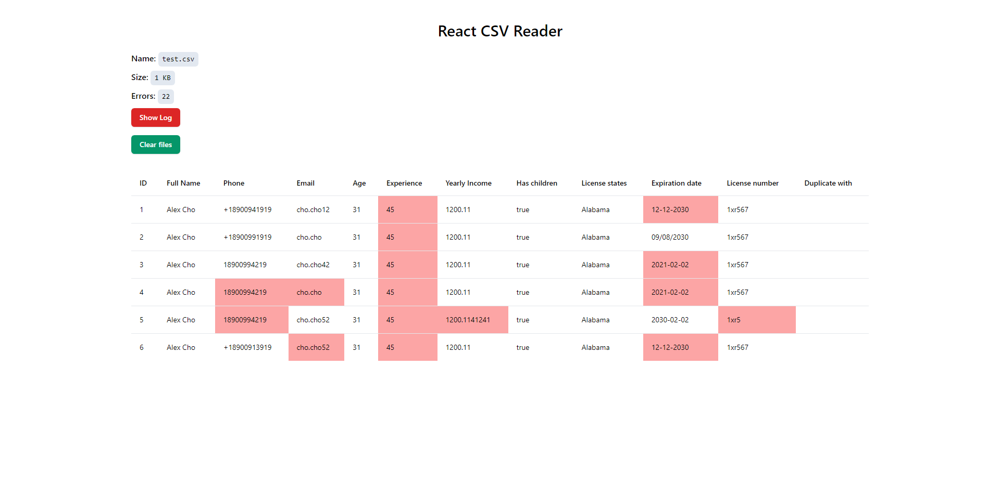

# React CSV Parser & Reader



Stack: React, Tailwind CSS, Papaparse

This project represents a CSVReader component, which takes a CSV file of a specific type, validates the table data, and parses it into a table.

For each error, you can see a detailed object of the following type:

```typescript
name: string
row: string
id: string
duplicateId?: number
```

## Validation rules:

- Data can have spaces before or after the text, so it should be ignored.
- Email and Phone must be unique within the file. AlexCho@cho.com is the same as alexCHO@CHO.coM. The Duplicate with column should list the ID of the first found row that - duplicates the email/phone of the current row.
- Age must be of type integer and not less than 21.
- Experience must be greater than or equal to 0 (and less than or equal to the current Age - 21).
- Yearly income can be of type integer or decimal but should always be displayed with two decimal places. It should not exceed 1 million.
- All numerical values must be >= 0 (depending on the field, age cannot be 0).
- License states can be in the form of abbreviations or have full names (e.g., AL, Alabama). However, only the short format should be displayed. There can be multiple values - separated by a vertical bar |.
- Expiration date can be accepted in two formats (YYYY-MM-DD or MM/DD/YYYY). Anything else is an error. It cannot be earlier than the current date.
- Phone must be displayed in the format +1xxxxxxxxxx (ten digits after +1). However, it can be imported in the formats: +1xxxxxxxxxx, 1xxxxxxxxxx, xxxxxxxxxx.
- Has children is accepted as TRUE/FALSE values. An empty cell is accepted as FALSE. Anything else is an error.
- License number should consist of 6 characters, which can be numbers or text characters.
- Full Name / Phone / Email are mandatory fields. If any of them are missing, a message indicating that the file is not valid should be displayed instead of the table. The same message should be displayed if the file format is not CSV. If the header name has a different case, such as "full Name," the field is considered valid.

## Learn More

You can learn more in the [Create React App documentation](https://facebook.github.io/create-react-app/docs/getting-started).

To learn React, check out the [React documentation](https://reactjs.org/).
